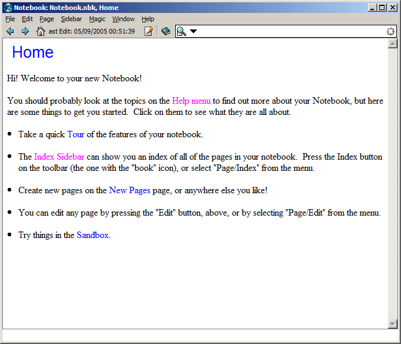
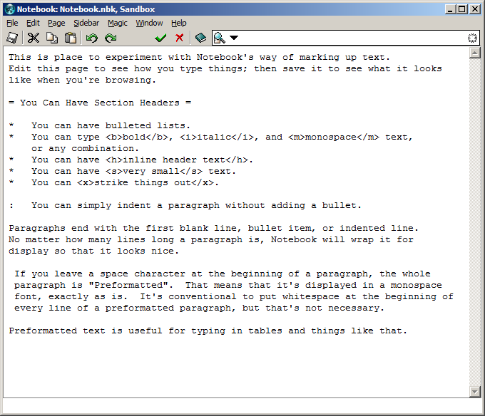
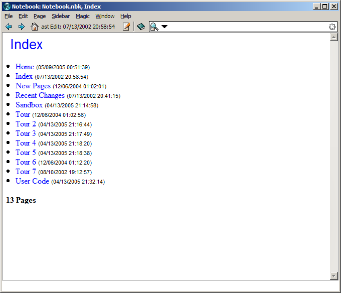

# Notebook Personal Wiki

# History

In 2005 I released Notebook v2.1.3, the latest, most up-to-date version of
an application I'd been working on for about four years.  Later, I spent
a great deal of time on Notebook v3, which ultimately failed due to problems
with a significant piece of infrastructure.  I stopped working on Notebook
altogether after that; the Notebook v3 project was a dead end, and I'd put
too much effort into v3 to be interested in Notebook v2.1.3.  

Recently, though, I've been interested in getting Notebook v2.1.3 working
again, using all of the latest Tcl/Tk bells and whistles.

This version is labeled Notebook v2.2.0; it's essentially Notebook v2.1.3
with the minimal changes required to get it working with the latest version
of Tcl/Tk.  I've not tested it thoroughly, but feel free to try it; your
data is always saved in a plain text file, so you aren't going to lose anything.

If you find any bugs, please write me a bug on the Notebook issue tracker
at https://github.com/wduquette/notebook/issues.

Will Duquette - will@wjduquette.com

# Screenshots

Some screenshots from Notebook v2.2.0 taken on Windows XP.

")

Notebook's Preferences dialog allows various style customization. Fonts are all set to Calibri, except Liberation Mono for "Mono Text".

")
